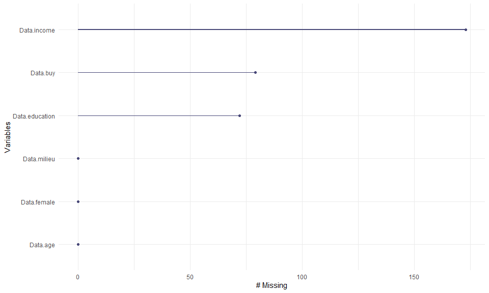
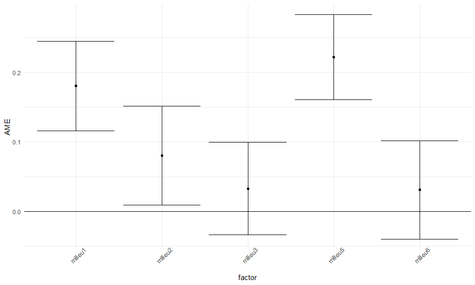
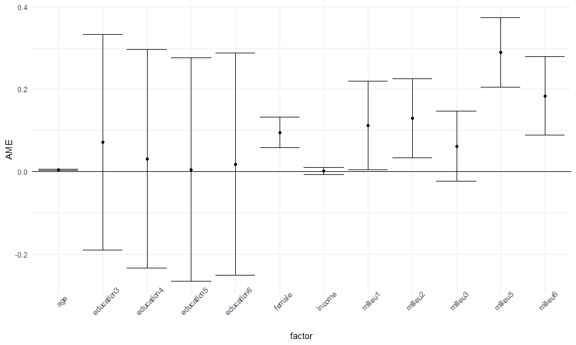

###  Fairtrade consumption and social milieu

#### Data: Umweltbewusstsein in Deutschland 2016 (Welle 1) - Version 1.0.0 (12.04.2017)

#### Data access: <a href="https://doi.org/10.4232/1.12764" class="uri">https://doi.org/10.4232/1.12764</a> (Gesis-Archiv - SPSS Data - SAV Format)

#### R Version 4.0.2 (22.06.2020) - RStudio Version 1.3.1056

<br>

#### Clear workspace

``` r
rm(list = ls())
```

#### Load packages

``` r
Packages <- c("tidyverse",     ## 1.3.0
            "naniar",        ## 0.5.0
            "haven",         ## 2.2.0
            "survey",        ## 3.37
            "car",           ## 3.0-6
            "gmodels",       ## 2.18.1
            "psych",         ## 1.9.12.31
            "mfx",           ## 1.2-2
            "epiDisplay",    ## 3.5.0.1
            "effects",       ## 4.1-4
            "DescTools",     ## 0.99.37
            "margins"        ## 0.3.23
            )

lapply(Packages, require, character.only = T)
```

### Data import and preparation (preparation of the analysis)

#### Read in data set

``` r
Data <- read_sav("Umweltbewusstsein_DE_2016_Welle1_v1-0-0.sav")
```

#### Create variable subset

``` r
Data <- Data %>%
  dplyr::select(f624_3, ## If possible, only buy products that have been produced under fair working conditions.
                f821,   ## gender (m = 1 / w = 2) 
                f8210,  ## Total monthly net income of a household (in 11 income groups).
                nf822,  ## Age of respondents in years.
                f823,   ## Educational attainment (highest school degree or university degree). 
                QCL_1,  ## Social milieus (six social segments, 17 items for identification).
                weight  ## Weighting variable (weighting by region, gender, age and education).
                )
```

#### Define missing data or unusable values as “NA”

``` r
Data <- Data %>%
  mutate(f624_3 = na_if(f624_3, 5), ## "don't know"
         f8210  = na_if(f8210, 12), ## "not specified"
         f823   = na_if(f823, 1),   ## "still student"
         f823   = na_if(f823, 7),   ## "Other school diploma"
         f823   = na_if(f823, 8)    ## "not specified"
         )
```

### Recode / dichotomize variables for analysis

#### Dichotomize target variable purchase probability as new variable “buy”

#### Recode categories 1 and 2 to 1 = Yes / categories 3 and 4 to 0 = No

``` r
Data <- Data %>%
  mutate(buy = car::recode(Data$f624_3,
                            "1:2 = 1; 3:4 = 0; else = NA", as.factor = T))
```

#### Gender from m = 1 / w = 2 to m = 0 / w = 1

#### New variable “female” (female = 1)

``` r
Data$female <- dummy.code(Data$f821, group = 2)
```

#### Define milieu as factor variable and thus automatically create a dummy variable

#### New variable “milieu” (milieu 1 automatically set as reference category)

#### Means: The first milieu is included in the calculation with 0 and the other categories with 1 each.

``` r
Data <- Data %>%
  mutate(milieu = car::recode(Data$QCL_1,
                            "1 = 1;
                             2 = 2;
                             3 = 3;
                             4 = 4; 
                             5 = 5;
                             6 = 6", 
                             as.factor = T))
```

#### Distribution of milieus rounded to one decimal place

``` r
round(prop.table(table(Data$milieu))*100, digits = 1)
```

    ## 
    ##    1    2    3    4    5    6 
    ## 12.7 20.2 25.2  8.4 15.2 18.3

#### How exactly is the variable “milieu” structured as a factor. Important for later model interpretation.

``` r
contrasts(Data$milieu)
```

    ##   2 3 4 5 6
    ## 1 0 0 0 0 0
    ## 2 1 0 0 0 0
    ## 3 0 1 0 0 0
    ## 4 0 0 1 0 0
    ## 5 0 0 0 1 0
    ## 6 0 0 0 0 1

#### Change reference category of milieu variable to 4 (preparation for logistic regression).

``` r
Data$milieu <- relevel (Data$milieu, ref = "4")
```

#### Structure of the variable after changing the reference category

#### Fourth milieu (precarious) set as reference and assigned value 0

``` r
contrasts(Data$milieu)
```

    ##   1 2 3 5 6
    ## 4 0 0 0 0 0
    ## 1 1 0 0 0 0
    ## 2 0 1 0 0 0
    ## 3 0 0 1 0 0
    ## 5 0 0 0 1 0
    ## 6 0 0 0 0 1

#### Define education as factor variable and thus automatically create a dummy variable

#### New variable “education” (“without degree” automatically set as reference category)

``` r
Data$education <- factor(Data$f823)
```

#### Add age variable as “age” for clarity

``` r
Data$age <- Data$nf822
```

#### Add income variable as “income” for clarity

``` r
Data$income <- Data$f8210
```

#### Missing values analysis

``` r
summary(Data)
```

    ##      f624_3           f821           f8210            nf822      
    ##  Min.   :1.000   Min.   :1.000   Min.   : 1.000   Min.   :14.00  
    ##  1st Qu.:1.000   1st Qu.:1.000   1st Qu.: 5.000   1st Qu.:34.00  
    ##  Median :2.000   Median :2.000   Median : 6.000   Median :51.00  
    ##  Mean   :1.971   Mean   :1.511   Mean   : 6.465   Mean   :49.26  
    ##  3rd Qu.:2.000   3rd Qu.:2.000   3rd Qu.: 9.000   3rd Qu.:64.00  
    ##  Max.   :4.000   Max.   :2.000   Max.   :11.000   Max.   :98.00  
    ##  NA's   :79                      NA's   :173                     
    ##       f823           QCL_1           weight        buy           female      
    ##  Min.   :2.000   Min.   :1.000   Min.   :0.103   0   : 373   Min.   :0.0000  
    ##  1st Qu.:4.000   1st Qu.:2.000   1st Qu.:0.496   1   :1578   1st Qu.:0.0000  
    ##  Median :5.000   Median :3.000   Median :0.797   NA's:  79   Median :1.0000  
    ##  Mean   :4.597   Mean   :3.482   Mean   :1.000               Mean   :0.5113  
    ##  3rd Qu.:6.000   3rd Qu.:5.000   3rd Qu.:1.303               3rd Qu.:1.0000  
    ##  Max.   :6.000   Max.   :6.000   Max.   :7.831               Max.   :1.0000  
    ##  NA's   :72                                                                  
    ##  milieu  education       age            income      
    ##  4:171   2   :  7   Min.   :14.00   Min.   : 1.000  
    ##  1:257   3   :411   1st Qu.:34.00   1st Qu.: 5.000  
    ##  2:410   4   :532   Median :51.00   Median : 6.000  
    ##  3:512   5   :422   Mean   :49.26   Mean   : 6.465  
    ##  5:308   6   :586   3rd Qu.:64.00   3rd Qu.: 9.000  
    ##  6:372   NA's: 72   Max.   :98.00   Max.   :11.000  
    ##                                     NA's   :173

#### Visualization of missing values

``` r
variables <-data.frame(Data$female, Data$education, Data$income, Data$age, Data$milieu, Data$buy)
gg_miss_var(variables)
```



### Check application requirements of binary logistic regression.

#### 1. No extreme unequal distribution of the dependent variable.

``` r
prop.table(table(Data$buy))*100
```

    ## 
    ##       0       1 
    ## 19.1184 80.8816

#### 2. Sufficient cases in predictor variable categories associated with outcome variable.

``` r
CrossTable(Data$milieu, Data$buy, prop.r=T, prop.c=F, prop.t=F, prop.chisq=F, digits = 2) 
```

    ## 
    ##  
    ##    Cell Contents
    ## |-------------------------|
    ## |                       N |
    ## |           N / Row Total |
    ## |-------------------------|
    ## 
    ##  
    ## Total Observations in Table:  1951 
    ## 
    ##  
    ##              | Data$buy 
    ##  Data$milieu |         0 |         1 | Row Total | 
    ## -------------|-----------|-----------|-----------|
    ##            4 |        44 |       113 |       157 | 
    ##              |      0.28 |      0.72 |      0.08 | 
    ## -------------|-----------|-----------|-----------|
    ##            1 |        33 |       215 |       248 | 
    ##              |      0.13 |      0.87 |      0.13 | 
    ## -------------|-----------|-----------|-----------|
    ##            2 |        69 |       329 |       398 | 
    ##              |      0.17 |      0.83 |      0.20 | 
    ## -------------|-----------|-----------|-----------|
    ##            3 |       124 |       368 |       492 | 
    ##              |      0.25 |      0.75 |      0.25 | 
    ## -------------|-----------|-----------|-----------|
    ##            5 |        15 |       288 |       303 | 
    ##              |      0.05 |      0.95 |      0.16 | 
    ## -------------|-----------|-----------|-----------|
    ##            6 |        88 |       265 |       353 | 
    ##              |      0.25 |      0.75 |      0.18 | 
    ## -------------|-----------|-----------|-----------|
    ## Column Total |       373 |      1578 |      1951 | 
    ## -------------|-----------|-----------|-----------|
    ## 
    ## 

#### 3. Low multicollinearity (Checked for overall model).

#### variance inflation factor (VIF) (should not exceed 10).

``` r
vif(m6.w)
```

    ##               GVIF Df GVIF^(1/(2*Df))
    ## female    1.029018  1        1.014405
    ## education 2.166764  4        1.101480
    ## income    1.347658  1        1.160887
    ## age       2.791546  1        1.670792
    ## milieu    5.255834  5        1.180495

### Binary logistic regression model

#### Dependent variable: buy from Fairtrade Yes (1) / No (0)

#### Independent variables: Gender, education, income, age, milieu

#### Exclusion of cases with missing values (“na.action=na.omit” set as default)

#### Models (each separately and at the end together in one model)

#### Error message “non-integer \#successes in a binomial glm!” comes up in each case.

#### This is due to the weighting, since there are no integer values left

#### The error message is therefore hidden in the following output

<br>

#### Zero model (unweighted)

``` r
m.null <- glm(buy ~ 1,
              family = binomial,
              data = Data)
summary(m.null)
```

    ## 
    ## Call:
    ## glm(formula = buy ~ 1, family = binomial, data = Data)
    ## 
    ## Deviance Residuals: 
    ##     Min       1Q   Median       3Q      Max  
    ## -1.8191   0.6514   0.6514   0.6514   0.6514  
    ## 
    ## Coefficients:
    ##             Estimate Std. Error z value Pr(>|z|)    
    ## (Intercept)  1.44234    0.05757   25.05   <2e-16 ***
    ## ---
    ## Signif. codes:  0 '***' 0.001 '**' 0.01 '*' 0.05 '.' 0.1 ' ' 1
    ## 
    ## (Dispersion parameter for binomial family taken to be 1)
    ## 
    ##     Null deviance: 1903.9  on 1950  degrees of freedom
    ## Residual deviance: 1903.9  on 1950  degrees of freedom
    ##   (79 observations deleted due to missingness)
    ## AIC: 1905.9
    ## 
    ## Number of Fisher Scoring iterations: 4

#### gender (weighted)

``` r
m1.w <- glm(buy ~ female,
            family = binomial,
            data = Data,
            weights = weight)
summary(m1.w)
```

    ## 
    ## Call:
    ## glm(formula = buy ~ female, family = binomial, data = Data, weights = weight)
    ## 
    ## Deviance Residuals: 
    ##     Min       1Q   Median       3Q      Max  
    ## -4.6809   0.3601   0.4868   0.6847   1.7152  
    ## 
    ## Coefficients:
    ##             Estimate Std. Error z value Pr(>|z|)    
    ## (Intercept)  1.11550    0.07526  14.822  < 2e-16 ***
    ## female       0.71523    0.11872   6.024  1.7e-09 ***
    ## ---
    ## Signif. codes:  0 '***' 0.001 '**' 0.01 '*' 0.05 '.' 0.1 ' ' 1
    ## 
    ## (Dispersion parameter for binomial family taken to be 1)
    ## 
    ##     Null deviance: 1898.9  on 1950  degrees of freedom
    ## Residual deviance: 1861.5  on 1949  degrees of freedom
    ##   (79 observations deleted due to missingness)
    ## AIC: 1863.4
    ## 
    ## Number of Fisher Scoring iterations: 4

#### education (weighted)

``` r
m2.w <- glm(buy ~ education,
            family = binomial,
            data = Data,
            weights = weight)
summary(m2.w)
```

    ## 
    ## Call:
    ## glm(formula = buy ~ education, family = binomial, data = Data, 
    ##     weights = weight)
    ## 
    ## Deviance Residuals: 
    ##     Min       1Q   Median       3Q      Max  
    ## -5.3546   0.3908   0.5673   0.6777   1.5206  
    ## 
    ## Coefficients:
    ##             Estimate Std. Error z value Pr(>|z|)
    ## (Intercept)  1.18090    0.78401   1.506    0.132
    ## education3   0.47507    0.79071   0.601    0.548
    ## education4   0.20211    0.79102   0.256    0.798
    ## education5  -0.04284    0.79812  -0.054    0.957
    ## education6   0.18826    0.79671   0.236    0.813
    ## 
    ## (Dispersion parameter for binomial family taken to be 1)
    ## 
    ##     Null deviance: 1785.1  on 1884  degrees of freedom
    ## Residual deviance: 1775.9  on 1880  degrees of freedom
    ##   (145 observations deleted due to missingness)
    ## AIC: 1787
    ## 
    ## Number of Fisher Scoring iterations: 4

#### income (weighted)

``` r
m3.w <- glm(buy ~ income,
            family = binomial,
            data = Data,
            weights = weight)
summary(m3.w)
```

    ## 
    ## Call:
    ## glm(formula = buy ~ income, family = binomial, data = Data, weights = weight)
    ## 
    ## Deviance Residuals: 
    ##     Min       1Q   Median       3Q      Max  
    ## -5.0557   0.3708   0.5374   0.6933   1.5501  
    ## 
    ## Coefficients:
    ##             Estimate Std. Error z value Pr(>|z|)    
    ## (Intercept) 1.375431   0.162140   8.483   <2e-16 ***
    ## income      0.009733   0.024672   0.394    0.693    
    ## ---
    ## Signif. codes:  0 '***' 0.001 '**' 0.01 '*' 0.05 '.' 0.1 ' ' 1
    ## 
    ## (Dispersion parameter for binomial family taken to be 1)
    ## 
    ##     Null deviance: 1748.4  on 1791  degrees of freedom
    ## Residual deviance: 1748.2  on 1790  degrees of freedom
    ##   (238 observations deleted due to missingness)
    ## AIC: 1742.8
    ## 
    ## Number of Fisher Scoring iterations: 4

#### age (weighted)

``` r
m4.w <- glm(buy ~ age,
            family = binomial,
            data = Data,
            weights = weight)
summary(m4.w)
```

    ## 
    ## Call:
    ## glm(formula = buy ~ age, family = binomial, data = Data, weights = weight)
    ## 
    ## Deviance Residuals: 
    ##     Min       1Q   Median       3Q      Max  
    ## -4.4675   0.3262   0.5236   0.6855   1.6565  
    ## 
    ## Coefficients:
    ##             Estimate Std. Error z value Pr(>|z|)    
    ## (Intercept) 0.509342   0.155982   3.265  0.00109 ** 
    ## age         0.019863   0.003218   6.172 6.74e-10 ***
    ## ---
    ## Signif. codes:  0 '***' 0.001 '**' 0.01 '*' 0.05 '.' 0.1 ' ' 1
    ## 
    ## (Dispersion parameter for binomial family taken to be 1)
    ## 
    ##     Null deviance: 1898.9  on 1950  degrees of freedom
    ## Residual deviance: 1859.8  on 1949  degrees of freedom
    ##   (79 observations deleted due to missingness)
    ## AIC: 1857.1
    ## 
    ## Number of Fisher Scoring iterations: 4

#### milieu (weighted)

``` r
m5.w <- glm(buy ~ milieu,
            family = binomial,
            data = Data,
            weights = weight)
summary(m5.w)
```

    ## 
    ## Call:
    ## glm(formula = buy ~ milieu, family = binomial, data = Data, weights = weight)
    ## 
    ## Deviance Residuals: 
    ##     Min       1Q   Median       3Q      Max  
    ## -5.0709   0.2436   0.4673   0.6691   1.7382  
    ## 
    ## Coefficients:
    ##             Estimate Std. Error z value Pr(>|z|)    
    ## (Intercept)   0.9743     0.1402   6.949 3.69e-12 ***
    ## milieu1       1.2934     0.2460   5.257 1.47e-07 ***
    ## milieu2       0.4523     0.2040   2.217   0.0266 *  
    ## milieu3       0.1717     0.1752   0.980   0.3272    
    ## milieu5       1.9195     0.3091   6.210 5.29e-10 ***
    ## milieu6       0.1624     0.1875   0.866   0.3864    
    ## ---
    ## Signif. codes:  0 '***' 0.001 '**' 0.01 '*' 0.05 '.' 0.1 ' ' 1
    ## 
    ## (Dispersion parameter for binomial family taken to be 1)
    ## 
    ##     Null deviance: 1898.9  on 1950  degrees of freedom
    ## Residual deviance: 1810.9  on 1945  degrees of freedom
    ##   (79 observations deleted due to missingness)
    ## AIC: 1822.8
    ## 
    ## Number of Fisher Scoring iterations: 5

#### Overall model (weighted) - socio-demographics as control variables.

``` r
m6.w <- glm(buy ~ female + education + income + age + milieu,
            family = binomial,
            data = Data,
            weights = weight)
summary(m6.w)
```

    ## 
    ## Call:
    ## glm(formula = buy ~ female + education + income + age + milieu, 
    ##     family = binomial, data = Data, weights = weight)
    ## 
    ## Deviance Residuals: 
    ##     Min       1Q   Median       3Q      Max  
    ## -4.0779   0.1917   0.4612   0.6463   2.0388  
    ## 
    ## Coefficients:
    ##              Estimate Std. Error z value Pr(>|z|)    
    ## (Intercept) -1.277187   0.914926  -1.396 0.162731    
    ## female       0.667700   0.134049   4.981 6.32e-07 ***
    ## education3   0.513920   0.850617   0.604 0.545729    
    ## education4   0.205692   0.859776   0.239 0.810920    
    ## education5   0.031382   0.878798   0.036 0.971514    
    ## education6   0.118313   0.875149   0.135 0.892460    
    ## income       0.007816   0.030581   0.256 0.798278    
    ## age          0.029095   0.006581   4.421 9.82e-06 ***
    ## milieu1      0.618234   0.310695   1.990 0.046608 *  
    ## milieu2      0.729261   0.270061   2.700 0.006927 ** 
    ## milieu3      0.321030   0.220737   1.454 0.145848    
    ## milieu5      2.549934   0.390853   6.524 6.84e-11 ***
    ## milieu6      1.130821   0.305692   3.699 0.000216 ***
    ## ---
    ## Signif. codes:  0 '***' 0.001 '**' 0.01 '*' 0.05 '.' 0.1 ' ' 1
    ## 
    ## (Dispersion parameter for binomial family taken to be 1)
    ## 
    ##     Null deviance: 1654.6  on 1737  degrees of freedom
    ## Residual deviance: 1503.2  on 1725  degrees of freedom
    ##   (292 observations deleted due to missingness)
    ## AIC: 1516.3
    ## 
    ## Number of Fisher Scoring iterations: 5

#### Model comparison and model quality

#### Log-Likelihood

``` r
logLik(m.null)
```

    ## 'log Lik.' -951.9617 (df=1)

``` r
logLik(m5.w) 
```

    ## 'log Lik.' -905.3995 (df=6)

``` r
logLik(m6.w)
```

    ## 'log Lik.' -745.1535 (df=13)

#### Likelihood-Ratio-Test

``` r
lrtest(m.null, m5.w)
```

    ## Likelihood ratio test for MLE method 
    ## Chi-squared 5 d.f. =  93.12431 , P value =  1.481293e-18

#### AIC - Akaike Information Criterion

``` r
AIC(m.null, m5.w, m6.w)
```

    ##        df      AIC
    ## m.null  1 1905.923
    ## m5.w    6 1822.799
    ## m6.w   13 1516.307

#### BIC - Bayesian Information Criterion

``` r
BIC(m.null, m5.w, m6.w)
```

    ##        df      BIC
    ## m.null  1 1911.499
    ## m5.w    6 1856.256
    ## m6.w   13 1587.293

#### Pseudo R2 (McKelvey & Zavoina)

#### Directly in percent and rounded to one decimal place

``` r
round((PseudoR2(m1.w, "McKelveyZavoina")*100), digits = 1)   ## gender
```

    ## McKelveyZavoina 
    ##             3.7

``` r
round((PseudoR2(m2.w, "McKelveyZavoina")*100), digits = 1)   ## education
```

    ## McKelveyZavoina 
    ##             0.9

``` r
round((PseudoR2(m3.w, "McKelveyZavoina")*100), digits = 2)   ## income
```

    ## McKelveyZavoina 
    ##            0.02

``` r
round((PseudoR2(m4.w, "McKelveyZavoina")*100), digits = 1)   ## age
```

    ## McKelveyZavoina 
    ##             3.7

``` r
round((PseudoR2(m5.w, "McKelveyZavoina")*100), digits = 1)   ## milieu
```

    ## McKelveyZavoina 
    ##            11.9

#### Overall model - R2 (McKelvey & Zavoina)

``` r
round((PseudoR2(m6.w, "McKelveyZavoina")*100), digits = 1) ## Overall model 
```

    ## McKelveyZavoina 
    ##            21.2

#### Proportion of explained variance by milieu in total explained variance.

``` r
round(11.9/21.2*100, digits = 1)
```

    ## [1] 56.1

#### Advanced analysis of the models

#### Odds Ratio

``` r
logistic.display(m5.w)
```

    ## 
    ## Logistic regression predicting buy : 1 vs 0 
    ##  
    ##                OR(95%CI)         P(Wald's test) P(LR-test)
    ## milieu: ref.=4                                  < 0.001   
    ##    1           3.65 (2.25,5.9)   < 0.001                  
    ##    2           1.57 (1.05,2.34)  0.027                    
    ##    3           1.19 (0.84,1.67)  0.327                    
    ##    5           6.82 (3.72,12.5)  < 0.001                  
    ##    6           1.18 (0.81,1.7)   0.386                    
    ##                                                           
    ## Log-likelihood = -905.3995
    ## No. of observations = 1951
    ## AIC value = 1822.799

``` r
logistic.display(m6.w)
```

    ## 
    ## Logistic regression predicting buy : 1 vs 0 
    ##  
    ##                     crude OR(95%CI)         adj. OR(95%CI)         
    ## female: 1 vs 0      2.07 (1.61,2.67)        1.95 (1.5,2.54)        
    ##                                                                    
    ## education: ref.=2                                                  
    ##    3                1.56 (0.33,7.36)        1.67 (0.32,8.86)       
    ##    4                1.22 (0.26,5.74)        1.23 (0.23,6.62)       
    ##    5                0.93 (0.19,4.47)        1.03 (0.18,5.78)       
    ##    6                1.26 (0.26,6.03)        1.13 (0.2,6.26)        
    ##                                                                    
    ## income (cont. var.) 0.9995 (0.9505,1.0511)  1.0078 (0.9492,1.0701) 
    ##                                                                    
    ## age (cont. var.)    1.02 (1.02,1.03)        1.03 (1.02,1.04)       
    ##                                                                    
    ## milieu: ref.=4                                                     
    ##    1                3.81 (2.31,6.31)        1.86 (1.01,3.41)       
    ##    2                1.65 (1.08,2.5)         2.07 (1.22,3.52)       
    ##    3                1.16 (0.81,1.65)        1.38 (0.89,2.12)       
    ##    5                9.09 (4.48,18.43)       12.81 (5.95,27.55)     
    ##    6                1.03 (0.69,1.54)        3.1 (1.7,5.64)         
    ##                                                                    
    ##                     P(Wald's test) P(LR-test)
    ## female: 1 vs 0      < 0.001        < 0.001   
    ##                                              
    ## education: ref.=2                  0.626     
    ##    3                0.546                    
    ##    4                0.811                    
    ##    5                0.972                    
    ##    6                0.892                    
    ##                                              
    ## income (cont. var.) 0.798          0.81      
    ##                                              
    ## age (cont. var.)    < 0.001        < 0.001   
    ##                                              
    ## milieu: ref.=4                     < 0.001   
    ##    1                0.047                    
    ##    2                0.007                    
    ##    3                0.146                    
    ##    5                < 0.001                  
    ##    6                < 0.001                  
    ##                                              
    ## Log-likelihood = -745.1535
    ## No. of observations = 1738
    ## AIC value = 1516.307

#### AME (Average Marginal Effects)

``` r
m5.w.marginal <- margins(m5.w)
summary(m5.w.marginal)
```

    ##   factor    AME     SE      z      p   lower  upper
    ##  milieu1 0.1802 0.0328 5.4994 0.0000  0.1160 0.2444
    ##  milieu2 0.0804 0.0362 2.2184 0.0265  0.0094 0.1514
    ##  milieu3 0.0328 0.0339 0.9680 0.3330 -0.0336 0.0992
    ##  milieu5 0.2216 0.0311 7.1305 0.0000  0.1607 0.2825
    ##  milieu6 0.0311 0.0361 0.8617 0.3888 -0.0396 0.1018

``` r
m6.w.marginal <- margins(m6.w) 
summary(m6.w.marginal)
```

    ##      factor    AME     SE      z      p   lower  upper
    ##         age 0.0041 0.0009 4.5808 0.0000  0.0024 0.0059
    ##  education3 0.0713 0.1339 0.5326 0.5943 -0.1911 0.3337
    ##  education4 0.0309 0.1353 0.2282 0.8195 -0.2344 0.2961
    ##  education5 0.0049 0.1385 0.0355 0.9717 -0.2665 0.2763
    ##  education6 0.0181 0.1377 0.1318 0.8951 -0.2517 0.2880
    ##      female 0.0951 0.0189 5.0241 0.0000  0.0580 0.1322
    ##      income 0.0011 0.0044 0.2557 0.7982 -0.0074 0.0096
    ##     milieu1 0.1125 0.0549 2.0495 0.0404  0.0049 0.2201
    ##     milieu2 0.1297 0.0492 2.6347 0.0084  0.0332 0.2262
    ##     milieu3 0.0618 0.0436 1.4183 0.1561 -0.0236 0.1472
    ##     milieu5 0.2892 0.0433 6.6834 0.0000  0.2044 0.3740
    ##     milieu6 0.1838 0.0488 3.7691 0.0002  0.0882 0.2793

#### Visualization of the AME

``` r
m5.w.marginal.sum <- summary(m5.w.marginal)

ggplot(data = m5.w.marginal.sum) +
  geom_point(aes(factor, AME)) +
  geom_errorbar(aes(x = factor, ymin = lower, ymax = upper)) +
  geom_hline(yintercept = 0) +
  theme_minimal() +
  theme(axis.text.x = element_text(angle = 45))
```



``` r
m6.w.marginal.sum <- summary(m6.w.marginal)

ggplot(data = m6.w.marginal.sum) +
  geom_point(aes(factor, AME)) +
  geom_errorbar(aes(x = factor, ymin = lower, ymax = upper)) +
  geom_hline(yintercept = 0) +
  theme_minimal() +
  theme(axis.text.x = element_text(angle = 45))
```


